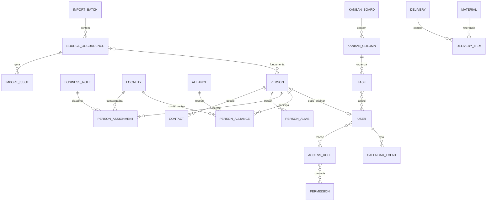

# PRD Sistema de Gestão da Campanha

**Versão:** 0.1  
**Status:** Rascunho para validação do gestor  
**Data:** 10 de setembro de 2026  
**Plataformas:** Web responsiva com prioridade para celular; definição do aplicativo mobile pendente  
**Stack definida:** Node.js, Express, PostgreSQL, Prisma e React

## Fontes e convenção de rastreabilidade

Este PRD usa as fontes abaixo. Os fatos sobre o áudio e a planilha vêm somente desses documentos. As escolhas de stack, arquitetura e interface informadas na solicitação atual aparecem como `USR`. Recomendações necessárias para completar a especificação, mas ainda não confirmadas, aparecem literalmente como **[suposição — validar com o gestor]**.

| Código | Fonte |
|---|---|
| TR-A | `analise/Transcricao_do_audio.md`, com referência por tempo |
| TR-E | `TRANSCRICAO-AUDIO-ELEVENLABS-LEVICANELA-SISTEMAPLANILHA.docx`, com referência por tempo |
| DIA | `analise/Analise_integrada_e_requisitos.md`, com referência por seção |
| PLA | `analise/Analise_da_planilha.md`, com referência por seção, aba ou célula |
| AUD | `analise/auditoria_independente.md`, com referência por seção, aba ou célula |
| USR | Requisitos técnicos e restrições fornecidos na solicitação deste PRD |
| DES | [Flip7 Design System](https://designmd.ai/yiujc/flip7-card-game), indicado pelo solicitante |

Quando uma fonte descreve uma possibilidade, este PRD não a transforma em obrigação. Quando duas fontes transcrevem um termo de forma diferente, a divergência permanece em **Decisões Pendentes**.

## 1 Resumo executivo

O Sistema de Gestão da Campanha será um hub administrativo para manter uma base única de pessoas, papéis de atuação, localidades, contatos e vínculos de dobrada. Sobre essa base, o sistema permitirá consultar a cobertura das cidades, acompanhar tarefas em Kanban, compartilhar compromissos em agenda e apoiar o controle de entregas de materiais. Pessoas habilitadas poderão alimentar a base conforme suas permissões. A possibilidade de alertas de agenda pelo WhatsApp será estudada separadamente e não integra o escopo obrigatório enquanto não for confirmada. **Fonte:** TR-A 00:11–03:58; TR-E 00:00:06–00:04:01; DIA, “Entendimento central”.

A experiência será mobile-first, pois a equipe usará o sistema com frequência pelo celular. O frontend seguirá a referência visual indicada no Design MD e será implementado com React e componentes shadcn/ui. O backend usará Node.js e Express; os dados serão armazenados em PostgreSQL com Prisma. Formulários e payloads serão validados com Zod, e a interface usará React Hook Form, TanStack Query, Zustand, Axios e TanStack Table conforme a responsabilidade de cada biblioteca. **Fonte:** USR; DES.

A migração não copiará a estrutura de 80 abas para o banco. A planilha contém visões territoriais e por dobrada que repetem ocorrências. O sistema separará cadastro de pessoa, papel, localidade, contato, vínculo e procedência da importação. Os registros suspeitos ou ambíguos entrarão em uma área de revisão, sem fusão, correção ou exclusão silenciosa. **Fonte:** DIA, “Modelo conceitual sugerido” e “Plano de migração recomendado”; PLA, “Conciliação e possíveis duplicidades”.

### Resultado esperado

O produto deverá permitir que a equipe trabalhe sobre informações consolidadas, saiba a origem de cada dado, identifique cadastros incompletos, controle quem pode consultar ou alterar cada módulo e mantenha agenda e tarefas acessíveis pelo celular. **Fonte:** TR-A 01:27–03:37; DIA, “Proposta de organização do sistema”; USR.

### Proposta de primeira entrega

**[suposição — validar com o gestor]** A primeira entrega deverá conter autenticação e RBAC, cadastro único, importação com revisão, consultas territoriais, Kanban e agenda compartilhada. O controle de materiais poderá entrar em uma etapa posterior, e o WhatsApp permanecerá fora do escopo obrigatório até a decisão do gestor. Esta ordem segue a sugestão de etapas do diagnóstico, mas o áudio não fixou a prioridade dos módulos. **Fonte:** DIA, “Etapas de entrega sugeridas”; TR-A 02:53–02:58.

## 2 Contexto e problema atual

### 2.1 Estrutura atual

A planilha possui 80 abas: um índice geral, oito índices regionais, 54 abas territoriais e 17 abas de dobradas. Não há fórmulas, tabelas estruturadas, gráficos, identificadores únicos ou atualização automática dos totais. A localidade fica implícita no nome da aba territorial; nas dobradas, o vínculo fica implícito no nome da aba. **Fonte:** PLA, “Estrutura integral do arquivo” e “O que cada linha representa”; AUD, “Critérios usados”.

Cada linha mistura conceitos diferentes: articulador, coordenador, contatos, liderança, região local, Dep Federal e religião. A posição das colunas não é totalmente uniforme. Em `Paty do Alferes!E2:F2`, Contato e Região aparecem invertidos em relação ao padrão. **Fonte:** PLA, “Dicionário de colunas e exceções”; AUD, “Campos deslocados e cadastros incompletos”.

### 2.2 Redundância e duplicidade

As abas territoriais contêm 681 linhas preenchidas. As abas de dobradas contêm 739 linhas, mas ambas as visões reapresentam parte dos mesmos registros. Não é correto somar os dois conjuntos nem interpretar qualquer um deles como quantidade de pessoas únicas. **Fonte:** PLA, “Como ler os resultados”; DIA, “O que o arquivo permite afirmar hoje”.

O intervalo `Vinicius Farah!A22:H58`, com 37 linhas, aparece de forma idêntica em `Marta Rocha!A22:H58`, `Sostenes!A22:H58`, `Abraão!A22:H58` e `Luciano Vieira!A22:H58`. As quatro repetições adicionam 148 linhas às abas de dobradas. A auditoria identifica forte indício de resíduo de cópia, mas não confirma se os vínculos são válidos ou inválidos. **Fonte:** AUD, “Blocos reproduzidos em quatro abas”; PLA, “Dobradas”.

Há um par completamente repetido em `Wellington José!A11:H12`, 13 pares candidatos com mesmo nome de liderança e mesma localidade, e cinco grupos de telefone repetido envolvendo 11 linhas territoriais. Esses casos não autorizam fusão automática de pessoas. **Fonte:** AUD, “Duplicidade e repetição entre visões”; PLA, “Conciliação e possíveis duplicidades”.

### 2.3 Divergência dos índices

O índice territorial exibe 672, enquanto as abas territoriais somam 681. O índice de dobradas exibe 591, enquanto as respectivas abas somam 739. Os números dos índices são valores gravados, não fórmulas. **Fonte:** `>>RIO DE JANEIRO<<!B11` e `B30`, conforme PLA, “Conciliação dos totais”; AUD, “Totais desatualizados”.

As diferenças territoriais incluem Paty do Alferes, Volta Redonda e Teresópolis. Na Costa Verde, divergências de Angra dos Reis e Itaguaí se compensam e fazem o subtotal coincidir, o que demonstra que a igualdade de um subtotal não garante a correção dos detalhes. **Fonte:** PLA, “Regiões”; AUD, “Totais desatualizados”.

### 2.4 Qualidade e completude

Das 681 linhas territoriais, 679 têm articulador, 315 têm coordenador, nenhuma possui o primeiro contato de coordenação preenchido, 676 têm liderança, 361 têm região local, 160 têm contato da liderança, 640 têm Dep Federal e 186 têm religião. Presença de conteúdo não comprova validade, identidade ou funcionamento do contato. **Fonte:** PLA, “Qualidade do preenchimento territorial”; AUD, “Preenchimento nas 681 linhas locais”.

Existem deslocamentos aparentes em Paraty e Serfiotis, variantes de grafia para localidades e nomes, 890 células com espaços externos, dez células compostas apenas por espaços e um hiperlink quebrado em `Mendes!I2`. **Fonte:** AUD, “Campos deslocados e cadastros incompletos” e “Cobertura, navegação e nomenclatura”; PLA, “Problemas que precisam ser tratados antes da importação definitiva”.

### 2.5 Problema de gestão

A planilha não oferece usuários, RBAC, histórico de alterações, tarefas, agenda, eventos, materiais ou entregas. Os totais dependem de manutenção manual e as visões redundantes podem divergir. O áudio descreve a necessidade de alimentação descentralizada por pessoas habilitadas e de uma ferramenta dinâmica, porque a equipe tem pouco tempo. **Fonte:** TR-A 02:29–03:23; TR-E 00:02:23–00:03:23; DIA, “Usuários e permissões” e “Tarefas e Kanban”.

## 3 Objetivo do sistema

### 3.1 Objetivo principal

Disponibilizar um hub administrativo mobile-first que consolide pessoas, funções, contatos, localidades e vínculos em uma base única e ofereça ferramentas de consulta territorial, tarefas, agenda e apoio a entregas. **Fonte:** TR-A 00:11–00:58, 01:27–02:22 e 03:05–03:37; DIA, “Entendimento central”; USR.

### 3.2 Objetivos específicos

| ID | Objetivo | Fonte |
|---|---|---|
| OBJ-01 | Representar articuladores, coordenadores e lideranças sem duplicar o cadastro da pessoa. | TR-A 00:31–00:58; DIA, “Como interpretar a hierarquia descrita” |
| OBJ-02 | Registrar localidades, áreas locais e vínculos de dobrada como relações explícitas. | TR-A 00:59–01:26; DIA, “Modelo conceitual sugerido” |
| OBJ-03 | Permitir visão do estado e identificação de cidades com informação ausente de coordenação ou liderança. | TR-A 01:27–01:42; DIA, “O que o áudio efetivamente pede” |
| OBJ-04 | Permitir filtros por região e cidade. | TR-A 01:44–02:02 e 02:20–02:23 |
| OBJ-05 | Permitir inclusão e manutenção da base por usuários habilitados. | TR-A 02:29–02:53 |
| OBJ-06 | Controlar tarefas pendentes em um Kanban. | TR-A 03:05–03:23; TR-E 00:03:05–00:03:23 |
| OBJ-07 | Disponibilizar uma agenda online atualizada para as pessoas autorizadas. | TR-A 03:24–03:37; TR-E 00:03:24–00:03:42 |
| OBJ-08 | Apoiar o controle administrativo de entregas de materiais. | TR-A 02:03–02:22; DIA, “Controle administrativo de materiais e entregas” |
| OBJ-09 | Preservar arquivo, aba, linha e valor original durante a migração. | DIA, “Plano de migração recomendado”; AUD, “Consequências para a importação” |
| OBJ-10 | Priorizar uso em celular e manter a experiência responsiva. | USR |

### 3.3 Fora do escopo confirmado

- Um mapa geográfico interativo. O áudio usa a palavra “mapa”, mas não esclarece se se trata de cartografia ou visão organizada por território. **Fonte:** DIA, “O que o áudio efetivamente pede”.
- Otimização automática de rotas, navegação rodoviária, frota ou capacidade de veículos. **Fonte:** TR-A 02:03–02:22; DIA, “Controle administrativo de materiais e entregas”.
- Disparo automático ou em massa para pessoas filtradas por localidade. O áudio descreve o uso do filtro para comunicação, mas não define automação do envio. **Fonte:** TR-A 01:44–02:02; `audio/Leitura_do_audio_e_requisitos_mencionados.md`, “Registro fiel das necessidades citadas”.
- Integração obrigatória com o Drive ou sincronização contínua da planilha. **Fonte:** TR-A 00:06–00:25; DIA, “Decisões que ainda precisam do gestor”.
- WhatsApp obrigatório na primeira entrega. A integração foi mencionada como possibilidade. **Fonte:** TR-A 03:38–03:58; TR-E 00:03:43–00:04:01.
- Número definitivo de pessoas únicas antes da conciliação. **Fonte:** PLA, “Como ler os resultados”; AUD, introdução.

### 3.4 Usuários envolvidos

| Usuário ou ator | Necessidade observada | Limite atual | Fonte |
|---|---|---|---|
| Pessoa habilitada para alimentar a base | Incluir novas lideranças com agilidade. | O áudio não define se poderá alterar, excluir, aprovar ou exportar. | TR-A 02:29–02:53 |
| Usuário do Kanban | Consultar tarefas pendentes conforme seu nível de acesso. | Os nomes citados e a matriz completa de permissões permanecem pendentes. | TR-A 03:05–03:23; TR-E 00:03:05–00:03:23 |
| Edson | Abrir a agenda por um link simples. | Consulta, edição e autenticação não estão definidas. | TR-A 03:24–03:37 |
| Coordenadores gerais | Possíveis destinatários de alertas de nova agenda. | A função é uma possibilidade, e os destinatários não foram nominados. | TR-A 03:38–03:58 |
| Administrador do sistema | **[suposição — validar com o gestor]** Gerir usuários, RBAC e conciliações. | O áudio não define quem exercerá essa função. | USR; DIA, “Usuários e permissões” |

### 3.5 Indicadores de sucesso propostos

Os indicadores abaixo medem a qualidade mínima da primeira entrega e são **[suposição — validar com o gestor]**. Eles derivam dos critérios de aceite do diagnóstico e não representam metas de adoção confirmadas.

- 100% das ocorrências importadas com arquivo, aba e linha rastreáveis. **Fonte:** DIA, “Critérios de aceite propostos”.
- Zero novas pessoas, atribuições ou vínculos ao reimportar o mesmo lote sem alterações. **Fonte:** DIA, “Plano de migração recomendado”.
- 100% dos casos conhecidos de duplicidade ou deslocamento apresentados na fila de revisão. **Fonte:** AUD, seções 2 a 5.
- 100% das operações protegidas verificadas pelo RBAC no backend. **Fonte:** USR; DIA, “Usuários e permissões”.
- Login inicial bloqueado até a troca da senha temporária. **Fonte:** USR.
- Fluxos da primeira entrega executáveis em viewport mobile. **Fonte:** USR.

## 4 Modelo de dados proposto

### 4.1 Princípios

1. Pessoa, usuário do sistema, papel de atuação, permissão, localidade, contato e vínculo são entidades diferentes. **Fonte:** DIA, “Modelo conceitual sugerido”; USR para RBAC.
2. Uma pessoa pode ter várias ocorrências importadas, sem que cada ocorrência crie uma nova pessoa. **Fonte:** DIA, “Modelo conceitual sugerido”.
3. Nome e telefone não serão chaves únicas de pessoa. **Fonte:** PLA, “Conciliação e possíveis duplicidades”; AUD, “Duplicidade e repetição entre visões”.
4. A procedência de cada dado importado será preservada. **Fonte:** DIA, “Plano de migração recomendado”; AUD, “Consequências para a importação”.
5. Campos ausentes permanecerão ausentes e serão sinalizados como pendência quando aplicável. **Fonte:** DIA, “Plano de migração recomendado”; PLA, “Qualidade do preenchimento territorial”.
6. Papel de atuação na campanha e papel de acesso ao sistema terão nomes e tabelas distintos. **Fonte:** DIA, “Usuários e permissões”; USR.

### 4.2 Entidades centrais

| Entidade | Campos principais propostos | Relações e observações | Fonte |
|---|---|---|---|
| `Person` | `id`, `displayName`, `canonicalName`, `status`, `notes`, timestamps | Cadastro único; nome original continua disponível nas ocorrências de origem. | DIA, “Cadastros e responsabilidades” |
| `PersonAlias` | `id`, `personId`, `value`, `sourceOccurrenceId` | Preserva variantes e apelidos sem corrigir nomes automaticamente. | PLA, “Nomes e localidades sem catálogo” |
| `Contact` | `id`, `personId`, `type`, `valueRaw`, `valueNormalized`, `isPrimary`, `status` | Um telefone pode ser compartilhado ou pertencer a representante; titularidade precisa ser revisável. | AUD, “Duplicidade e repetição entre visões” |
| `Locality` | `id`, `name`, `canonicalName`, `type`, `parentId`, `status` | Hierarquia permite região, município e área local, conforme decisão pendente. | DIA, “Modelo conceitual sugerido” |
| `LocalityAlias` | `id`, `localityId`, `value`, `sourceOccurrenceId` | Mantém grafias originais e correspondências aprovadas. | AUD, “Cobertura, navegação e nomenclatura” |
| `BusinessRole` | `id`, `code`, `name` | Catálogo inicial observado: articulador, coordenador e liderança. | TR-A 00:31–00:58 |
| `PersonAssignment` | `id`, `personId`, `businessRoleId`, `localityId`, `reportsToAssignmentId`, `startsAt`, `endsAt`, `status` | Representa função e contexto sem duplicar pessoa. Cardinalidades e histórico dependem de validação. | DIA, “Como interpretar a hierarquia descrita” |
| `Alliance` | `id`, `name`, `canonicalName`, `status` | Representa a dobrada citada no áudio e a coluna Dep Federal. Não presume cargo atual. | TR-A 00:59–01:26; PLA, “O que cada linha representa” |
| `PersonAlliance` | `id`, `personId`, `allianceId`, `localityId`, `startsAt`, `endsAt`, `status`, `sourceOccurrenceId` | Uma relação é distinta da pessoa e mantém procedência. Multiplicidade pendente. | DIA, “Modelo conceitual sugerido” |

### 4.3 Usuários e RBAC

| Entidade | Campos principais propostos | Regra | Fonte |
|---|---|---|---|
| `User` | `id`, `personId?`, `username`, `passwordHash`, `status`, `mustChangePassword`, `lastLoginAt`, timestamps | A conta não é criada automaticamente para toda pessoa cadastrada. | DIA, “Usuários e permissões”; USR |
| `AccessRole` | `id`, `code`, `name`, `description` | Papel técnico usado pelo RBAC; não se confunde com articulador/coordenador/liderança. | USR; DIA, “Usuários e permissões” |
| `Permission` | `id`, `resource`, `action` | Permissões por recurso e ação. | USR |
| `AccessRolePermission` | `accessRoleId`, `permissionId` | Relação N:N entre papel e permissão. | USR |
| `UserAccessRole` | `userId`, `accessRoleId`, `scopeType`, `scopeId?` | Permite escopo global ou territorial. **[suposição — validar com o gestor]** | TR-A 02:29–02:53; USR |
| `AuthSession` | `id`, `userId`, `expiresAt`, `revokedAt`, `metadata` | **[suposição — validar com o gestor]** necessária apenas se houver refresh token ou revogação imediata de sessões. | USR; decisão pendente de sessão |

O login utilizará usuário e senha. Criação e troca de senha exigirão senha e confirmação de senha. Senhas serão armazenadas somente como hash bcrypt, com custo entre 10 e 12. O access token JWT expirará em 15 minutos. No primeiro login, `mustChangePassword` bloqueará o restante da aplicação até que o usuário defina uma nova senha. **Fonte:** USR.

**[suposição — validar com o gestor]** Não haverá auto cadastro público. Um administrador criará ou habilitará as contas e entregará uma senha temporária por processo definido fora deste PRD. A hipótese deriva da fala sobre “pessoas selecionadas” e “já habilitadas”. **Fonte:** TR-A 02:29–02:50.

### 4.4 Importação e conciliação

| Entidade | Campos principais propostos | Função | Fonte |
|---|---|---|---|
| `ImportBatch` | `id`, `fileName`, `fileHash`, `revision`, `startedAt`, `finishedAt`, `status`, contagens | Identifica o lote e impede repetição silenciosa do mesmo arquivo. | DIA, “Plano de migração recomendado” |
| `SourceOccurrence` | `id`, `batchId`, `sheetName`, `rowNumber`, `viewType`, `rawData`, `normalizedData`, `status` | Conserva cada linha e seus valores originais. | AUD, “Consequências para a importação” |
| `ImportIssue` | `id`, `occurrenceId`, `type`, `severity`, `details`, `status`, `resolvedBy`, `resolvedAt` | Fila para duplicidade, deslocamento, grafia e campo ausente. | DIA, “Plano de migração recomendado” |
| `ReconciliationDecision` | `id`, `issueId`, `decision`, `targetEntityType`, `targetEntityId`, `reason`, `decidedBy`, `decidedAt` | Registra aprovação, separação, fusão ou descarte de uma ocorrência. | DIA, “Critérios de aceite propostos” |
| `EntitySource` | `id`, `entityType`, `entityId`, `occurrenceId`, `fieldMapping` | Liga o cadastro consolidado a todas as suas origens. | DIA, “Modelo conceitual sugerido” |

### 4.5 Módulos operacionais

| Entidade | Campos principais propostos | Observação | Fonte |
|---|---|---|---|
| `KanbanBoard` | `id`, `name`, `visibilityScope`, `status` | **[suposição — validar com o gestor]** permite mais de um quadro. O áudio confirma um Kanban, não a quantidade. | TR-A 03:05–03:23 |
| `KanbanColumn` | `id`, `boardId`, `name`, `position`, `isTerminal` | Estados são configuráveis. “A fazer”, “Em andamento” e “Concluído” são sugestão do diagnóstico. | DIA, “Tarefas e Kanban” |
| `Task` | `id`, `boardId`, `columnId`, `title`, `description`, `dueAt`, `priority`, `createdBy`, timestamps | Título, descrição, prazo e prioridade são **[suposição — validar com o gestor]**. | DIA, “Tarefas e Kanban” |
| `TaskAssignee` | `taskId`, `userId` | **[suposição — validar com o gestor]** permite um ou mais responsáveis. | TR-A 03:05–03:23 |
| `CalendarEvent` | `id`, `title`, `description`, `startsAt`, `endsAt`, `timezone`, `localityId`, `address`, `status`, `visibility`, `createdBy`, `version` | Campos mínimos sugeridos; `version` evita sobrescrita silenciosa concorrente. | DIA, “Agenda compartilhada” |
| `EventParticipant` | `eventId`, `userId`, `role`, `notificationPreference` | **[suposição — validar com o gestor]** define pessoas necessárias e responsabilidade no compromisso. | TR-A 03:24–03:37 |
| `ShareLink` | `id`, `eventId?`, `calendarScope?`, `tokenHash`, `permission`, `expiresAt`, `revokedAt` | **[suposição — validar com o gestor]** implementa link controlado e revogável caso esse modo seja aprovado. | DIA, “Agenda compartilhada” |
| `Material` | `id`, `name`, `unit`, `status` | Campo proposto; a planilha não contém catálogo de materiais. | DIA, “Controle administrativo de materiais e entregas” |
| `Delivery` | `id`, `origin`, `destination`, `localityId`, `address`, `responsibleUserId`, `scheduledAt`, `deliveredAt`, `status`, `notes` | Campos são **[suposição — validar com o gestor]**. A fala confirma apoio a entregas, não estoque nem otimização. | TR-A 02:03–02:22; DIA, “Controle administrativo de materiais e entregas” |
| `DeliveryItem` | `deliveryId`, `materialId`, `quantity` | **[suposição — validar com o gestor]** necessária para registrar itens e quantidades. | DIA, “Controle administrativo de materiais e entregas” |
| `Notification` | `id`, `channel`, `eventType`, `recipient`, `payload`, `status`, `idempotencyKey`, `attemptedAt`, `error` | Somente se WhatsApp for aprovado. Campos de controle seguem a recomendação de evitar duplicidade e registrar falhas. | DIA, “Alertas internos de agenda” |
| `AuditLog` | `id`, `userId`, `action`, `entityType`, `entityId`, `beforeData`, `afterData`, `createdAt` | Registra autor, data e alteração em cadastros e módulos. | DIA, “Usuários e permissões” |

### 4.6 Relações principais



## 5 Requisitos funcionais

### 5.1 Autenticação e acesso

| ID | Requisito | Fonte |
|---|---|---|
| RF-AUT-001 | O sistema deve autenticar por usuário e senha. | USR |
| RF-AUT-002 | A criação e a troca de senha devem exigir confirmação de senha e validar igualdade no formulário e na API. | USR |
| RF-AUT-003 | O backend deve armazenar somente o hash bcrypt da senha, com custo configurado entre 10 e 12. | USR |
| RF-AUT-004 | O access token JWT deve expirar em 15 minutos, salvo exceção documentada por funcionalidade. | USR |
| RF-AUT-005 | O primeiro login deve exigir troca de senha antes de liberar os demais módulos. | USR |
| RF-AUT-006 | O sistema deve aplicar RBAC e validar permissão no backend em cada operação protegida. | USR; DIA, “Usuários e permissões” |
| RF-AUT-007 | Cadastro de pessoa não deve criar automaticamente uma conta de usuário. | DIA, “Usuários e permissões” |
| RF-AUT-008 | Usuários habilitados devem conseguir incluir novas lideranças dentro de seu escopo autorizado. | TR-A 02:29–02:53 |
| RF-AUT-009 | O sistema deve registrar autor e data das alterações protegidas. | DIA, “Usuários e permissões” |
| RF-AUT-010 | **[suposição — validar com o gestor]** Administradores devem habilitar, suspender e redefinir acesso de usuários. | TR-A 02:29–02:53; USR |

### 5.2 Cadastro único de pessoas

| ID | Requisito | Fonte |
|---|---|---|
| RF-PES-001 | O sistema deve manter uma pessoa em um cadastro único, independente das visualizações territorial e de dobrada. | DIA, “Cadastros e responsabilidades”; PLA, “Implicações administrativas” |
| RF-PES-002 | O cadastro deve manter papéis de articulador, coordenador e liderança como relações separadas e contextualizadas por localidade. | TR-A 00:31–00:58; DIA, “Como interpretar a hierarquia descrita” |
| RF-PES-003 | O sistema deve permitir associar contatos à pessoa correta e preservar valor original e valor normalizado. | AUD, “Duplicidade e repetição entre visões”; DIA, “Modelo conceitual sugerido” |
| RF-PES-004 | O sistema deve registrar vínculos de dobrada sem duplicar a pessoa. | TR-A 00:59–01:26; DIA, “Cadastros e responsabilidades” |
| RF-PES-005 | O sistema deve aceitar cadastros incompletos oriundos da migração e mostrar pendências específicas. | PLA, “Qualidade do preenchimento territorial” |
| RF-PES-006 | O sistema não deve inferir identidade, religião, papel ou vínculo por nome, título ou proximidade entre linhas. | PLA, “Qualidade do preenchimento territorial”; DIA, “Cadastros e responsabilidades” |
| RF-PES-007 | Toda informação migrada deve permitir consulta de arquivo, aba, linha e valor original. | DIA, “Plano de migração recomendado”; AUD, “Consequências para a importação” |
| RF-PES-008 | O sistema deve permitir pesquisar e filtrar cadastros por região e cidade. | TR-A 01:44–02:02 e 02:20–02:23 |
| RF-PES-009 | **[suposição — validar com o gestor]** A pesquisa poderá usar nome, papel e contato, respeitando permissões de visualização. | DIA, “Cadastros e responsabilidades” |
| RF-PES-010  | O sistema deve preservar aliases aprovados de nomes e localidades e nunca substituir silenciosamente o valor de origem. | PLA, “Cobertura e padronização de localidades”; AUD, “Cobertura, navegação e nomenclatura” |

### 5.3 Cobertura territorial

| ID | Requisito | Fonte |
|---|---|---|
| RF-TER-001 | O sistema deve apresentar visão consolidada do estado por região e cidade. | TR-A 01:27–01:34 |
| RF-TER-002 | O sistema deve identificar localidades sem informação cadastrada de coordenação ou liderança, distinguindo campo ausente de ausência confirmada. | TR-A 01:34–01:42; DIA, “O que o arquivo permite afirmar hoje” |
| RF-TER-003 | Os totais devem ser calculados a partir da base consolidada e identificados como pessoas, atribuições, vínculos ou ocorrências de origem. | PLA, “Problemas que precisam ser tratados antes da importação definitiva” |
| RF-TER-004 | Filtros de região e cidade devem atualizar as listas e contagens apresentadas. | TR-A 01:44–02:23 |
| RF-TER-005 | **[suposição — validar com o gestor]** A primeira versão usará listas, cartões e indicadores; mapa cartográfico dependerá de confirmação. | DIA, “O que o áudio efetivamente pede” |

### 5.4 Kanban de tarefas

| ID | Requisito | Fonte |
|---|---|---|
| RF-KAN-001 | O sistema deve disponibilizar um Kanban para tarefas pendentes. | TR-A 03:05–03:23; TR-E 00:03:05–00:03:23 |
| RF-KAN-002 | O acesso ao Kanban deve respeitar o nível de acesso do usuário. | TR-A 03:14–03:23 |
| RF-KAN-003 | **[suposição — validar com o gestor]** Usuários autorizados poderão criar, editar, atribuir e mover tarefas entre colunas. | DIA, “Tarefas e Kanban” |
| RF-KAN-004 | **[suposição — validar com o gestor]** Cada tarefa terá título, descrição, responsável, prazo, prioridade, coluna atual e histórico. | DIA, “Tarefas e Kanban” |
| RF-KAN-005 | Mudanças de coluna devem persistir e ser vistas de forma consistente pelos usuários autorizados. | DIA, “Critérios de aceite propostos” |
| RF-KAN-006 | **[suposição — validar com o gestor]** As colunas serão configuráveis; a configuração inicial proposta é A fazer, Em andamento e Concluído. | DIA, “Tarefas e Kanban” |

### 5.5 Agenda compartilhada

| ID | Requisito | Fonte |
|---|---|---|
| RF-AGE-001 | O sistema deve disponibilizar uma agenda online com informações atualizadas para as pessoas autorizadas. | TR-A 03:24–03:37; TR-E 00:03:24–00:03:42 |
| RF-AGE-002 | O sistema deve oferecer um modo de acesso por link simples, com permissão de consulta ou edição ainda pendente. | TR-A 03:29–03:37; DIA, “Agenda compartilhada” |
| RF-AGE-003 | **[suposição — validar com o gestor]** O compromisso terá título, início, término, fuso, local, descrição, responsável, status e visibilidade. | DIA, “Agenda compartilhada” |
| RF-AGE-004 | **[suposição — validar com o gestor]** Usuários autorizados poderão criar, editar e cancelar compromissos. | DIA, “Decisões que ainda precisam do gestor” |
| RF-AGE-005 | O sistema deve impedir que edições concorrentes sobrescrevam alterações silenciosamente. | DIA, “Critérios de aceite propostos” |
| RF-AGE-006 | **[suposição — validar com o gestor]** Links sem login, se aprovados, serão controlados, revogáveis, limitados por permissão e passíveis de expiração. | DIA, “Agenda compartilhada” |
| RF-AGE-007 | Falha em uma integração de alerta não deve impedir o salvamento do compromisso. | DIA, “Alertas internos de agenda” |

### 5.6 Apoio a entregas de materiais

| ID | Requisito | Fonte |
|---|---|---|
| RF-ENT-001 | O sistema deve apoiar a organização de entregas de material por localidade e responsáveis disponíveis. | TR-A 02:03–02:22 |
| RF-ENT-002 | **[suposição — validar com o gestor]** O módulo deve registrar solicitação, destino, endereço informado, responsável, data, situação e observações. | DIA, “Controle administrativo de materiais e entregas” |
| RF-ENT-003 | **[suposição — validar com o gestor]** Uma entrega poderá registrar materiais e quantidades. | DIA, “Controle administrativo de materiais e entregas” |
| RF-ENT-004 | Endereço ausente deve aparecer como pendência e não como destino confirmado. | DIA, “Critérios de aceite propostos” |
| RF-ENT-005 | O módulo não deve prometer otimização automática de rotas ou controle de estoque antes dessas decisões. | TR-A 02:03–02:22; DIA, “Controle administrativo de materiais e entregas” |

### 5.7 Possível alerta de agenda por WhatsApp

**Status:** possibilidade mencionada, não confirmada como requisito obrigatório. **Fonte:** TR-A 03:38–03:58; TR-E 00:03:43–00:04:01.

| ID | Requisito condicionado à aprovação | Fonte |
|---|---|---|
| RF-WPP-001 | Se aprovado, o sistema deverá alertar os destinatários internos configurados quando ocorrer o evento de agenda definido pelo gestor. | TR-A 03:44–03:58; DIA, “Alertas internos de agenda” |
| RF-WPP-002 | **[suposição — validar com o gestor]** A integração deverá usar idempotência para evitar o mesmo alerta mais de uma vez por destinatário e evento. | DIA, “Alertas internos de agenda” |
| RF-WPP-003 | **[suposição — validar com o gestor]** Tentativas, sucesso e falhas deverão ficar registradas para consulta e nova tentativa. | DIA, “Alertas internos de agenda” |
| RF-WPP-004 | Edição, cancelamento e lembrete só deverão gerar mensagens se cada gatilho for aprovado. | DIA, “Alertas internos de agenda” |
| RF-WPP-005 | O texto reconhecido como “API do WhatsApp” não será usado para escolher fornecedor ou arquitetura até a confirmação do gestor. | Restrição USR; TR-A 03:48–03:50; TR-E 00:03:47–00:04:01 |

### 5.8 Importação e revisão dos dados

| ID | Requisito | Fonte |
|---|---|---|
| RF-IMP-001 | O importador deve reconhecer as 80 abas e classificar índice geral, índices regionais, abas territoriais e abas de dobradas. | PLA, “Estrutura integral do arquivo” |
| RF-IMP-002 | O importador deve contar 681 linhas territoriais e 739 ocorrências em dobradas segundo o critério documentado, antes de qualquer conciliação. | AUD, “Critérios usados” e introdução |
| RF-IMP-003 | O importador deve tratar índices como controles de conferência e não como registros de pessoas. | DIA, “Plano de migração recomendado” |
| RF-IMP-004 | O importador deve mapear cabeçalhos reais e reconhecer a inversão de Contato e Região em Paty do Alferes. | PLA, “Dicionário de colunas e exceções” |
| RF-IMP-005 | O importador deve ignorar linhas somente formatadas e células compostas apenas por espaços, preservando registros parcialmente preenchidos. | DIA, “Plano de migração recomendado”; AUD, “Critérios usados” |
| RF-IMP-006 | Os quatro blocos de 37 linhas devem receber marcação de revisão e não podem ser excluídos, fundidos ou publicados como vínculos definitivos sem decisão registrada. | AUD, “Blocos reproduzidos em quatro abas”; restrição USR |
| RF-IMP-007 | O par `Wellington José!A11:H12`, os 13 pares candidatos e os cinco grupos de telefone repetido devem entrar na fila de conciliação sem fusão automática. | AUD, “Duplicidade e repetição entre visões” |
| RF-IMP-008 | Paraty, Serfiotis e `Rio de Janeiro!A94:H94` devem entrar na fila de revisão por deslocamento ou ausência de campos. | AUD, “Campos deslocados e cadastros incompletos” |
| RF-IMP-009 | A normalização deve conservar o valor original e registrar a transformação aplicada. | AUD, “Cobertura, navegação e nomenclatura” |
| RF-IMP-010 | Reimportar o mesmo lote deve ser idempotente e não criar pessoas, atribuições ou vínculos duplicados. | DIA, “Plano de migração recomendado” |
| RF-IMP-011 | O fechamento do lote deve informar linhas lidas, ignoradas, conciliadas, mantidas em revisão e incorporadas, separando pessoas, vínculos e ocorrências. | DIA, “Plano de migração recomendado” |
| RF-IMP-012 | Toda decisão manual de conciliação deve registrar usuário, data, motivo, ocorrências envolvidas e destino consolidado. | DIA, “Critérios de aceite propostos” |

### 5.9 Interface e navegação propostas

As telas abaixo organizam requisitos já descritos. A divisão exata das telas é **[suposição — validar com o gestor]**.

| Tela | Conteúdo principal | Requisitos relacionados |
|---|---|---|
| Login | Usuário, senha, erros e recuperação a definir | RF-AUT-001 a RF-AUT-005 |
| Troca obrigatória de senha | Nova senha e confirmação | RF-AUT-002 e RF-AUT-005 |
| Início | Pendências, compromissos próximos, tarefas e cobertura | RF-TER, RF-KAN e RF-AGE |
| Pessoas | Busca, filtros, cadastro e estado de revisão | RF-PES |
| Pessoa | Dados, contatos, atribuições, vínculos e procedência | RF-PES-001 a RF-PES-007 |
| Cobertura | Região, cidade, contagens e campos ausentes | RF-TER |
| Kanban | Colunas, cartões, filtros e responsáveis | RF-KAN |
| Agenda | Lista/calendário, criação e edição conforme permissão | RF-AGE |
| Entregas | Solicitações, destinos, itens e situações | RF-ENT |
| Revisão de importação | Lotes, divergências, comparação e decisões | RF-IMP |
| Administração | Usuários, papéis RBAC e permissões | RF-AUT-006 a RF-AUT-010 |

## 6 Requisitos não funcionais

### 6.1 Arquitetura e stack

| ID | Requisito | Fonte |
|---|---|---|
| RNF-ARQ-001 | O projeto deve usar monorepo com `apps/web`, `apps/mobile`, `apps/api`, `packages/database`, `packages/ui` e pacotes compartilhados necessários. | USR |
| RNF-ARQ-002 | A API deve usar Node.js e Express em arquitetura por camadas, com controllers, services e repositories. | USR |
| RNF-ARQ-003 | O banco deve usar PostgreSQL e Prisma, com migrações versionadas em `packages/database`. | USR |
| RNF-ARQ-004 | O frontend web deve usar React. | USR |
| RNF-ARQ-005 | **[suposição — validar com o gestor]** `apps/mobile` permanecerá preparado no monorepo, mas a decisão entre aplicativo nativo, PWA ou apenas web responsiva deve ser tomada antes da implementação desse pacote. | USR; decisão pendente de plataforma mobile |
| RNF-ARQ-006 | Tipos e schemas compartilháveis devem ficar em pacote comum, sem acoplar controllers diretamente ao Prisma. | USR, arquitetura em camadas |

### 6.2 Validação e dados no frontend

| ID | Requisito | Fonte |
|---|---|---|
| RNF-FE-001 | Formulários e payloads de API devem usar schemas Zod, com validação também no servidor. | USR |
| RNF-FE-002 | Formulários React devem usar React Hook Form e integração com Zod por `@hookform/resolvers`. | USR |
| RNF-FE-003 | Campos que exigirem máscara devem usar `input-otp` ou `react-imask` conforme o tipo de entrada. | USR |
| RNF-FE-004 | Dados vindos da API devem ser gerenciados com TanStack Query. | USR |
| RNF-FE-005 | Estado global estritamente de interface deve usar Zustand. Dados do servidor não devem ser duplicados sem necessidade nesse estado. | USR |
| RNF-FE-006 | O cliente HTTP deve usar Axios com interceptors para tratamento comum de autenticação e erros HTTP. | USR |
| RNF-FE-007 | Tabelas administrativas devem usar TanStack Table com filtros, ordenação e paginação compatíveis com a API. | USR |
| RNF-FE-008 | Gráficos devem usar Recharts ou Tremor. A escolha final permanece em Decisões Pendentes. | USR |

### 6.3 Mobile first e experiência

| ID | Requisito | Fonte |
|---|---|---|
| RNF-UX-001 | Toda funcionalidade da primeira entrega deve ser utilizável em tela de celular antes da adaptação para desktop. | USR |
| RNF-UX-002 | Ações principais devem permanecer acessíveis sem depender de hover. | USR, prioridade mobile-first |
| RNF-UX-003 | Tabelas largas devem oferecer visualização mobile adequada, com cartões, colunas priorizadas ou rolagem controlada conforme a tarefa. | USR; RF-PES e RF-IMP |
| RNF-UX-004 | Estados de carregamento, vazio, erro, sucesso e ausência de permissão devem ser explícitos. | USR, TanStack Query e Axios |
| RNF-UX-005 | A implementação visual deve aplicar as habilidades Design Taste Frontend e Frontend Design ao criar o site e os componentes shadcn/ui. | USR |
| RNF-UX-006 | GSAP e Framer Motion devem ser usados apenas em transições que esclareçam estado, navegação ou reordenação; animações não devem atrasar tarefas administrativas. | USR; orientação de uso funcional **[suposição — validar com o gestor]** |
| RNF-UX-007 | A criação do site deve começar de um template padrão alinhado ao Design MD indicado, em vez de uma composição visual genérica. | USR; DES |

### 6.4 Sistema visual

A interface deverá adaptar o Design MD indicado para um produto administrativo mobile-first. A referência visual possui base clara, teal principal, dourado de destaque, coral para alertas, cartões brancos, superfícies de entrada em creme, botões em formato de cápsula e sombras coloridas em elementos interativos. **Fonte:** USR; DES.

| Token ou padrão | Direção para o sistema | Fonte |
|---|---|---|
| Primária | Teal `#2BA8A2`; variações clara `#3CC4BD` e escura `#1E8C86` | DES |
| Destaque | Dourado `#FFD23F`; uso em ação principal e estado ativo | DES |
| Alerta | Coral `#EF6C4A`; vermelho `#E74C3C` reservado a erro | DES |
| Sucesso e informação | Verde `#27AE60` e azul `#5DADE2` | DES |
| Superfícies | Fundo `#EFF8F7`, cartão branco e campos creme `#FFF8E7` | DES |
| Forma | Cartões com profundidade, botões em cápsula e divisores pontilhados quando ajudarem a leitura | DES |
| Tipografia | Stack de sistema, títulos fortes e corpo legível em celular | DES; USR |

Elementos específicos de jogo, como confete, coroas, estado BOOM e celebrações, não são requisitos do sistema administrativo. **[suposição — validar com o gestor]** A implementação manterá a linguagem visual e substituirá a semântica de jogo por estados próprios dos módulos.

### 6.5 Segurança

| ID | Requisito | Fonte |
|---|---|---|
| RNF-SEG-001 | Senhas devem usar bcrypt com custo entre 10 e 12, sem armazenamento ou log da senha em texto aberto. | USR |
| RNF-SEG-002 | Access tokens JWT devem expirar em 15 minutos. | USR |
| RNF-SEG-003 | Permissões RBAC devem ser verificadas no backend, inclusive quando a interface esconder a ação. | USR; DIA, “Usuários e permissões” |
| RNF-SEG-004 | O primeiro login deve bloquear operações até a troca obrigatória da senha temporária. | USR |
| RNF-SEG-005 | **[suposição — validar com o gestor]** Produção deve exigir HTTPS, cookies seguros quando usados, política de CORS restrita e segredos fora do repositório. | Necessidade técnica não definida nas fontes |
| RNF-SEG-006 | **[suposição — validar com o gestor]** Tentativas de login devem ter limitação e auditoria para reduzir ataques de força bruta. | Necessidade técnica não definida nas fontes |
| RNF-SEG-007 | O campo religião, se mantido, deve ter finalidade definida e acesso restrito; não poderá alimentar classificação automática de pessoas. | PLA, “Qualidade do preenchimento territorial”; AUD, “Consequências para a importação” |

### 6.6 Desempenho e disponibilidade

| ID | Requisito proposto | Fonte |
|---|---|---|
| RNF-DES-001 | **[suposição — validar com o gestor]** Em conexão móvel estável, telas principais devem exibir conteúdo útil em até 2,5 segundos no percentil 75, excluindo upload e processamento de importações. | USR, prioridade mobile-first |
| RNF-DES-002 | **[suposição — validar com o gestor]** Consultas paginadas devem responder em até 500 ms no percentil 95 para a carga inicial estimada. | Meta técnica sem volume de usuários confirmado |
| RNF-DES-003 | Importações devem rodar como processo controlado, com progresso e resultado persistidos, sem bloquear requisições comuns. | DIA, “Plano de migração recomendado”; implementação **[suposição — validar com o gestor]** |
| RNF-DES-004 | A agenda e o Kanban devem refletir alterações após revalidação dos dados, sem exigir que o usuário encerre a sessão. | DIA, “Critérios de aceite propostos”; USR, TanStack Query |

### 6.7 Acessibilidade, compatibilidade e qualidade

| ID | Requisito proposto | Fonte |
|---|---|---|
| RNF-QLD-001 | **[suposição — validar com o gestor]** A interface deve buscar conformidade WCAG 2.2 nível AA nas telas da primeira entrega. | Meta técnica não definida nas fontes |
| RNF-QLD-002 | **[suposição — validar com o gestor]** O sistema deve suportar as duas versões estáveis mais recentes de Chrome, Safari, Edge e Firefox, incluindo Safari e Chrome mobile. | USR, prioridade mobile-first |
| RNF-QLD-003 | A API deve devolver erros estruturados e a interface deve traduzi-los em mensagens acionáveis. | USR, Zod e Axios |
| RNF-QLD-004 | **[suposição — validar com o gestor]** Logs técnicos não devem conter senhas, tokens ou dados pessoais completos desnecessários. | Meta técnica não definida nas fontes |
| RNF-QLD-005 | **[suposição — validar com o gestor]** Mudanças de esquema, serviços e fluxos críticos devem possuir testes automatizados proporcionais ao risco. | Meta técnica não definida nas fontes |

### 6.8 Continuidade e operação

| ID | Requisito proposto | Fonte |
|---|---|---|
| RNF-OPS-001 | **[suposição — validar com o gestor]** O banco deve ter backup automático, restauração testada e política de retenção aprovada antes da produção. | DIA, decisão pendente sobre backup e conservação |
| RNF-OPS-002 | **[suposição — validar com o gestor]** Erros da API, falhas de importação e falhas de notificação devem possuir observabilidade e correlação por requisição ou operação. | DIA, “Alertas internos de agenda” e “Plano de migração recomendado” |
| RNF-OPS-003 | O sistema deve manter histórico de alterações relevantes para cadastros, permissões, tarefas, agenda e conciliação. | DIA, “Usuários e permissões” e critérios de aceite |

## 7 Plano de migração da planilha atual

### 7.1 Estratégia

A migração terá uma camada de staging. Nenhuma linha irá diretamente da planilha para um cadastro consolidado sem manter sua ocorrência de origem. Índices serão importados como controles de conferência, e as abas territoriais e de dobradas serão importadas como ocorrências separadas. **Fonte:** DIA, “Plano de migração recomendado”; AUD, “Consequências para a importação”.

### 7.2 Etapas

| Etapa | Procedimento | Saída verificável | Fonte |
|---|---|---|---|
| MIG-01 | Registrar nome, hash, revisão e data do arquivo. | `ImportBatch` único. | DIA, “Guardar a origem” |
| MIG-02 | Classificar as 80 abas em 1 índice geral, 8 índices regionais, 54 territoriais e 17 dobradas. | Inventário de abas. | PLA, “Estrutura integral do arquivo” |
| MIG-03 | Ler linha 3 em diante e considerar cadastro quando A:H tiver conteúdo após remover espaços externos. | 681 ocorrências territoriais e 739 de dobradas. | AUD, “Critérios usados” |
| MIG-04 | Mapear colunas pelo cabeçalho e pelo tipo de aba. | Paty do Alferes interpretada com E/F invertidas. | PLA, “Dicionário de colunas e exceções” |
| MIG-05 | Armazenar dados brutos e gerar versão normalizada para comparação. | Valor original e normalizado rastreáveis. | AUD, “Cobertura, navegação e nomenclatura” |
| MIG-06 | Gerar candidatos de pessoa, localidade, papel, contato e vínculo sem fusão automática por nome ou telefone. | Fila de correspondências e ambiguidades. | DIA, “Cadastros e responsabilidades”; AUD, “Duplicidade e repetição” |
| MIG-07 | Isolar divergências conhecidas e exigir decisão humana. | `ImportIssue` para cada caso. | AUD, seções 2 a 5 |
| MIG-08 | Publicar apenas entidades e vínculos aprovados; manter o restante em revisão. | Base consolidada e fila pendente. | DIA, “Plano de migração recomendado” |
| MIG-09 | Reconciliar contagens por tipo de entidade e ocorrência. | Relatório de fechamento do lote. | DIA, “Reconciliar por lote” |
| MIG-10 | Reexecutar o lote em teste. | Nenhuma duplicação adicional. | DIA, “Evitar repetição da mesma carga” |

### 7.3 Tratamento das 148 linhas duplicadas

O sistema não decidirá se as 148 ocorrências devem ser removidas ou mantidas como vínculos. Durante a importação:

1. As 37 linhas de `Vinicius Farah!A22:H58` e as cópias em Marta Rocha, Sostenes, Abraão e Luciano Vieira serão preservadas como ocorrências distintas de origem. **Fonte:** AUD, “Blocos reproduzidos em quatro abas”.
2. As 148 cópias receberão o tipo de pendência `SUSPECTED_COPIED_ALLIANCE_BLOCK`. **[suposição — validar com o gestor]** O nome técnico da pendência é proposto; a preservação e revisão vêm do diagnóstico.
3. O painel mostrará comparação célula a célula, vínculo implícito da aba, correspondência territorial e impacto na contagem. **[suposição — validar com o gestor]**
4. Nenhum `PersonAlliance` definitivo será criado a partir dessas 148 ocorrências até que o gestor escolha manter, rejeitar ou corrigir cada bloco. **Fonte:** restrição USR; DIA, “Decisões que ainda precisam do gestor”.
5. A decisão será registrada com usuário, data e justificativa. **Fonte:** DIA, “Critérios de aceite propostos”.

### 7.4 Reconciliação dos índices divergentes

O sistema preservará os totais manuais como controles históricos e calculará, separadamente, as contagens encontradas nas linhas. Não escolherá 672, 681, 591 ou 739 como quantidade de pessoas únicas.

| Controle | Valor manual | Contagem das abas | Tratamento |
|---|---:|---:|---|
| Territorial | 672 | 681 | Mostrar diferença de +9 e detalhar as localidades divergentes. |
| Dobradas | 591 | 739 | Mostrar diferença de +148 e relacionar os quatro blocos de 37 linhas. |

**Fonte:** PLA, “Conciliação dos totais”; AUD, “Totais desatualizados” e “Blocos reproduzidos em quatro abas”.

Após as decisões de conciliação, o sistema deverá apresentar pelo menos quatro métricas distintas: ocorrências importadas, pessoas consolidadas, atribuições territoriais e vínculos de dobrada. **Fonte:** DIA, “Plano de migração recomendado”; PLA, “Problemas que precisam ser tratados antes da importação definitiva”.

### 7.5 Fila inicial de revisão

- Quatro blocos de 37 linhas reproduzidos. **Fonte:** AUD, seção 2.
- Par repetido em `Wellington José!A11:H12`. **Fonte:** AUD, seção 3.
- Treze pares candidatos pelo mesmo nome de liderança e localidade. **Fonte:** AUD, seção 3.
- Cinco grupos de telefones repetidos, incluindo `Iguaba Grande!F14` e `F16`. **Fonte:** AUD, seção 3.
- Quatro linhas de Paraty com provável deslocamento de Liderança para Região. **Fonte:** AUD, seção 4.
- Divergência de campos em Serfiotis e Barra do Piraí. **Fonte:** AUD, seção 4.
- Linha `Rio de Janeiro!A94:H94` sem identificação da liderança. **Fonte:** AUD, seção 4.
- Grafias divergentes e oito ocorrências de localidade sem correspondência normalizada. **Fonte:** AUD, seção 5.
- Mendes e Teresópolis sem links de entrada e `Mendes!I2` com destino quebrado. Esse problema é evidência da origem; não afeta o modelo consolidado. **Fonte:** AUD, seção 5.

### 7.6 Validação do lote

O lote só poderá ser encerrado quando as contagens brutas forem reproduzidas, todos os registros tiverem destino ou pendência explícita e a reimportação não criar novas entidades. O encerramento não exige que todas as pendências estejam resolvidas, mas deve informar quantas permanecem abertas. **Fonte:** DIA, “Critérios de aceite propostos” e “Plano de migração recomendado”.

## 8 Critérios de aceite

### 8.1 Autenticação e permissões

| ID | Critério |
|---|---|
| CA-AUT-01 | Dado um usuário ativo com senha temporária, quando autenticar com credenciais válidas, o sistema emite JWT de acesso com validade de 15 minutos e direciona para troca obrigatória de senha. **Cobre:** RF-AUT-001, 004 e 005. |
| CA-AUT-02 | A troca só é aceita quando senha e confirmação coincidem e cumprem o schema validado no formulário e na API. **Cobre:** RF-AUT-002; RNF-FE-001 e 002. |
| CA-AUT-03 | Depois da troca, nenhuma senha em texto aberto aparece no banco ou nos logs, e o hash bcrypt usa custo entre 10 e 12. **Cobre:** RF-AUT-003; RNF-SEG-001. |
| CA-AUT-04 | Um usuário sem permissão recebe resposta de acesso negado mesmo ao chamar a API diretamente. **Cobre:** RF-AUT-006; RNF-SEG-003. |
| CA-AUT-05 | Criar uma pessoa não cria uma conta de acesso. **Cobre:** RF-AUT-007. |

### 8.2 Cadastro e cobertura

| ID | Critério |
|---|---|
| CA-PES-01 | Uma pessoa pode aparecer em várias ocorrências, atribuições ou vínculos sem duplicação automática do cadastro consolidado. **Cobre:** RF-PES-001, 002, 004 e 007. |
| CA-PES-02 | Nome ou telefone coincidente cria candidato de revisão e não realiza fusão automática. **Cobre:** RF-PES-003 e 006. |
| CA-PES-03 | Um cadastro incompleto é salvo com seus campos ausentes e exibe pendências específicas. **Cobre:** RF-PES-005. |
| CA-PES-04 | O detalhe da pessoa permite chegar ao arquivo, aba, linha e valores que sustentam cada dado migrado. **Cobre:** RF-PES-007. |
| CA-TER-01 | Ao filtrar região ou cidade, listas e contagens usam a base consolidada e identificam a unidade contada. **Cobre:** RF-PES-008; RF-TER-001, 003 e 004. |
| CA-TER-02 | Localidade sem preenchimento de coordenação ou liderança aparece como “informação ausente”, sem afirmar ausência real de pessoas. **Cobre:** RF-TER-002. |

### 8.3 Kanban

| ID | Critério |
|---|---|
| CA-KAN-01 | Usuário autorizado visualiza o quadro e usuário sem permissão não acessa seus dados pela interface nem pela API. **Cobre:** RF-KAN-001 e 002. |
| CA-KAN-02 | Ao mover uma tarefa, a coluna é persistida e reaparece corretamente após recarregar ou abrir em outro usuário autorizado. **Cobre:** RF-KAN-005. |
| CA-KAN-03 | Campos e transições configurados na decisão do gestor são validados no frontend e na API. **Cobre:** RF-KAN-003, 004 e 006, condicionados à validação. |

### 8.4 Agenda

| ID | Critério |
|---|---|
| CA-AGE-01 | Um compromisso criado ou alterado por usuário autorizado aparece atualizado aos demais usuários com acesso. **Cobre:** RF-AGE-001. |
| CA-AGE-02 | O link simples respeita a decisão de consulta ou edição e pode ser revogado se o modo controlado for aprovado. **Cobre:** RF-AGE-002 e 006. |
| CA-AGE-03 | Duas edições concorrentes não apagam silenciosamente a alteração anterior; o sistema informa conflito e oferece recarregamento. **Cobre:** RF-AGE-005. |
| CA-AGE-04 | Falha do canal de alerta não impede criar ou alterar o compromisso. **Cobre:** RF-AGE-007. |

### 8.5 Entregas

| ID | Critério |
|---|---|
| CA-ENT-01 | Se o módulo entrar na entrega, um registro aprovado permite identificar destino, responsável e situação. **Cobre:** RF-ENT-001 e 002. |
| CA-ENT-02 | Endereço ausente permanece como pendência e não é apresentado como endereço validado. **Cobre:** RF-ENT-004. |
| CA-ENT-03 | A interface não apresenta otimização de rotas ou saldo de estoque sem que essas funções tenham sido aprovadas. **Cobre:** RF-ENT-005. |

### 8.6 WhatsApp condicionado

| ID | Critério |
|---|---|
| CA-WPP-01 | Se aprovado, o gatilho definido gera no máximo um alerta por destinatário e evento. **Cobre:** RF-WPP-001 e 002. |
| CA-WPP-02 | Sucesso, falha e nova tentativa ficam observáveis para usuário autorizado. **Cobre:** RF-WPP-003. |
| CA-WPP-03 | Edição, cancelamento ou lembrete não dispara mensagem sem regra aprovada para o evento. **Cobre:** RF-WPP-004. |

### 8.7 Migração

| ID | Critério |
|---|---|
| CA-IMP-01 | A leitura reconhece 80 abas e produz 681 ocorrências territoriais e 739 ocorrências de dobradas antes da conciliação. **Cobre:** RF-IMP-001 e 002. |
| CA-IMP-02 | Os totais manuais 672 e 591 são mostrados como controles históricos, separados das contagens 681 e 739 e de pessoas consolidadas. **Cobre:** RF-IMP-003 e 011. |
| CA-IMP-03 | `Paty do Alferes!E:F` é interpretada conforme seus cabeçalhos. **Cobre:** RF-IMP-004. |
| CA-IMP-04 | Os quatro blocos de 37 linhas aparecem em revisão sem exclusão, fusão ou criação definitiva de vínculo. **Cobre:** RF-IMP-006. |
| CA-IMP-05 | Paraty, Serfiotis, o par de Wellington José, os 13 pares candidatos e os cinco grupos de telefone aparecem na fila apropriada. **Cobre:** RF-IMP-007 e 008. |
| CA-IMP-06 | Uma segunda execução do mesmo arquivo não aumenta pessoas, atribuições ou vínculos. **Cobre:** RF-IMP-010. |
| CA-IMP-07 | Cada decisão de conciliação informa usuário, data, motivo e ocorrências envolvidas. **Cobre:** RF-IMP-012. |
| CA-IMP-08 | O relatório do lote separa linhas lidas, ignoradas, conciliadas, incorporadas e em revisão, além de pessoas, atribuições e vínculos. **Cobre:** RF-IMP-011. |

### 8.8 Mobile first e interface

| ID | Critério |
|---|---|
| CA-UX-01 | Login, troca de senha, cadastro, filtros, Kanban, agenda e revisão de pendências podem ser executados em viewport de celular sem depender de hover ou desktop. **Cobre:** RNF-UX-001 e 002. |
| CA-UX-02 | Tabelas extensas oferecem apresentação utilizável no celular e não ocultam ações essenciais. **Cobre:** RNF-UX-003. |
| CA-UX-03 | As telas implementadas usam o sistema visual referenciado, com contraste e sem importar semântica de jogo para ações administrativas. **Cobre:** RNF-UX-005 e seção 6.4. |
| CA-UX-04 | Cada consulta assíncrona apresenta carregamento, vazio e erro; ações protegidas distinguem sessão expirada de permissão insuficiente. **Cobre:** RNF-UX-004; RNF-FE-004 e 006. |

## 9 Decisões pendentes

O PRD permanece aberto até que o gestor delibere sobre os itens abaixo. Nenhuma dessas decisões foi tomada neste documento.

| ID | Decisão necessária | Evidência e impacto |
|---|---|---|
| DP-001 | Os quatro blocos de 37 linhas pertencem a Marta Rocha, Sostenes, Abraão e Luciano Vieira ou são resíduos de cópia de Vinicius Farah? | Define se 148 ocorrências geram vínculos, são corrigidas ou são rejeitadas. AUD, seção 2. |
| DP-002 | Qual fonte prevalece após a revisão: índices manuais, abas territoriais, abas de dobradas ou decisão por campo e ocorrência? | O arquivo mostra 672 vs. 681 e 591 vs. 739. PLA, “Conciliação dos totais”. |
| DP-003 | Qual é a identidade e a grafia corretas do nome ouvido como “Levi Carnela”/“Levi Carnella”? | TR-A marca o nome como incerto; TR-E traz “Levi Carnella”. Não criar usuário com esse nome antes da confirmação. |
| DP-004 | A expressão correta é “API do WhatsApp”? Existe uma integração institucional já disponível? | TR-A mantém o termo incerto; TR-E o registra de forma mais assertiva. Define viabilidade e fornecedor. |
| DP-005 | Pode haver mais de um coordenador por cidade? Uma pessoa pode acumular papéis, localidades e dobradas? | Define cardinalidades e validações de `PersonAssignment` e `PersonAlliance`. DIA, “Decisões que ainda precisam do gestor”. |
| DP-006 | O primeiro campo Contato pertence ao coordenador e o segundo à liderança? Telefones podem pertencer a representantes? | Define mapeamento e titularidade dos contatos. PLA, “O que cada linha representa”. |
| DP-007 | Como corrigir os deslocamentos de Paraty e Serfiotis? | Define os valores publicados para liderança, região e contatos. AUD, seção 4. |
| DP-008 | “Mapa” significa painel territorial ou mapa geográfico interativo? Quais níveis territoriais serão suportados? | Define interface, catálogo de localidades e eventual serviço cartográfico. TR-A 00:17–00:30; DIA, decisões. |
| DP-009 | Quais papéis RBAC existem e qual escopo cada um pode consultar, cadastrar, alterar, excluir e exportar? | O áudio só afirma que pessoas selecionadas serão habilitadas e cita dois usuários com mesmo nível. TR-A 02:29–03:23. |
| DP-010 | Haverá auto cadastro, recuperação de senha, refresh token, encerramento remoto de sessões e MFA? | A solicitação define login, JWT de 15 minutos, bcrypt e troca no primeiro acesso, mas não esses fluxos. USR. |
| DP-011 | Edson acessará agenda para consultar, editar ou ambos? O link exigirá login ou será controlado por token? | TR-A 03:24–03:37; DIA, “Agenda compartilhada”. |
| DP-012 | Quais campos, status, responsáveis e regras de visibilidade serão usados no Kanban? | O áudio confirma tarefas pendentes, sem fluxo completo. TR-A 03:05–03:23. |
| DP-013 | O módulo de materiais controlará solicitações e entregas, estoque, rotas ou uma combinação? | O áudio menciona rota como exemplo, sem especificar estoque ou otimização. TR-A 02:03–02:22. |
| DP-014 | O WhatsApp faz parte de qual etapa, quem recebe e quais ações da agenda geram mensagem? | A fala usa linguagem condicional. TR-A 03:38–03:58. |
| DP-015 | O campo religião será migrado e mantido? Qual é sua finalidade, visibilidade e retenção? | O campo existe em 186 de 681 linhas territoriais e exige acesso restrito se mantido. PLA, “Qualidade do preenchimento territorial”. |
| DP-016 | A primeira entrega inclui aplicativo mobile, PWA ou apenas web responsiva? | USR define mobile-first e monorepo com `apps/mobile`, mas não define tecnologia mobile. |
| DP-017 | Recharts ou Tremor será a biblioteca de gráficos? Quais indicadores precisam de gráfico? | USR fornece as duas opções; os dados de relatório necessários ainda não estão fechados. |
| DP-018 | Qual é o prazo, número de usuários simultâneos, orçamento e prioridade formal dos módulos? | O áudio informa apenas que há pouco tempo. TR-A 02:51–02:58. |
| DP-019 | A planilha continuará sendo atualizada depois da migração? Haverá novas revisões ou integração com o Drive? | Define sincronização e conflito de fonte. DIA, “Decisões que ainda precisam do gestor”. |
| DP-020 | Qual política de backup, retenção, exportação e exclusão se aplica aos dados? | DIA registra a decisão como aberta. |

## 10 Riscos e mitigações

| ID | Risco | Consequência | Mitigação proposta | Fonte |
|---|---|---|---|---|
| RSK-001 | Fusão incorreta de pessoas por nome ou telefone. | Perda de identidade e relações atribuídas à pessoa errada. | Manter ocorrência de origem, gerar candidato e exigir decisão humana. | AUD, seção 3 |
| RSK-002 | Publicação das 148 linhas como vínculos válidos sem revisão. | Totais e relações incorretos. | Quarentena lógica e bloqueio de publicação até DP-001. | AUD, seção 2; restrição USR |
| RSK-003 | Uso dos índices manuais como verdade. | Indicadores desatualizados e falsa reconciliação. | Guardar índices como controle e calcular métricas da base consolidada. | PLA, “Conciliação dos totais” |
| RSK-004 | Mapeamento por posição fixa. | Contato importado como região em Paty do Alferes e outros deslocamentos. | Mapear por cabeçalho e validar exceções conhecidas. | PLA, “Dicionário de colunas e exceções” |
| RSK-005 | Campos vazios tratados como zero ou inexistência real. | Conclusões incorretas sobre cobertura territorial. | Estado explícito de informação ausente e fila de pendências. | DIA, “O que o arquivo permite afirmar hoje” |
| RSK-006 | Exposição indevida de contato, religião ou vínculos. | Acesso incompatível com a finalidade dos dados. | RBAC no backend, auditoria e decisão específica sobre religião. | PLA, “Qualidade do preenchimento territorial”; USR |
| RSK-007 | Escopo crescer para mapa, rotas, estoque e WhatsApp simultaneamente. | Atraso na entrega em contexto de pouco tempo. | Validar etapas, manter WhatsApp condicionado e decidir o MVP. | TR-A 02:53–03:58; DIA, “Etapas de entrega sugeridas” |
| RSK-008 | Link simples expor agenda além do público pretendido. | Acesso não autorizado a compromissos. | Definir consulta/edição, autenticação, expiração e revogação em DP-011. | DIA, “Agenda compartilhada” |
| RSK-009 | JWT curto prejudicar uso em campo sem estratégia de sessão. | Logins frequentes ou tentativa insegura de aumentar validade. | Fechar DP-010 antes da implementação da renovação de sessão. | USR |
| RSK-010 | Interface desktop adaptada tardiamente para celular. | Operação lenta durante uso em campo. | Criar e testar fluxos em viewport mobile desde o primeiro componente. | USR |
| RSK-011 | Uso excessivo de animação ou estética de jogo. | Interface administrativa lenta ou pouco clara. | Aplicar Design Taste Frontend, limitar animação a feedback funcional e adaptar a semântica visual. | USR; DES |
| RSK-012 | Alterações concorrentes em agenda, tarefas ou conciliação. | Sobrescrita silenciosa e decisões perdidas. | Controle de versão, revalidação e histórico de alterações. | DIA, critérios de aceite |
| RSK-013 | Reimportação criar novos cadastros. | Crescimento artificial e nova duplicidade. | Hash do lote, chaves de ocorrência e teste de idempotência. | DIA, “Plano de migração recomendado” |
| RSK-014 | Falha do WhatsApp interromper a agenda. | Compromisso não registrado por indisponibilidade externa. | Persistir primeiro, processar alerta separadamente e registrar falhas se aprovado. | DIA, “Alertas internos de agenda” |
| RSK-015 | Requisitos técnicos de disponibilidade e retenção não definidos. | Produção sem metas verificáveis. | Fechar DP-018 e DP-020 antes do plano de lançamento. | DIA, decisões pendentes |

## Apêndice A Arquitetura de referência

Esta organização implementa a stack fornecida. Detalhes internos adicionais são **[suposição — validar com o gestor]** até a fase de arquitetura.

```text
apps/
  web/                    React mobile-first
  mobile/                 tecnologia e escopo pendentes
  api/
    src/
      controllers/
      services/
      repositories/
      middlewares/
      routes/
      modules/
packages/
  database/               Prisma schema, migrations e client
  ui/                     componentes shadcn/ui e tokens do Design MD
  validation/             schemas Zod compartilhados quando aplicável
  types/                  contratos e tipos sem dependência de framework
  config/                 configurações compartilhadas permitidas
```

Fluxo da API: rota e middleware autenticam a requisição; controller valida e traduz HTTP; service aplica regras de negócio; repository acessa Prisma; banco persiste dados e auditoria. **Fonte:** USR, arquitetura em camadas.

### Domínios de API propostos

- `/auth`, `/users`, `/access-roles` para autenticação e RBAC.
- `/people`, `/contacts`, `/assignments`, `/localities`, `/alliances` para cadastro consolidado.
- `/coverage` para consultas territoriais.
- `/boards`, `/tasks` para Kanban.
- `/calendar-events`, `/share-links` para agenda.
- `/materials`, `/deliveries` para logística aprovada.
- `/imports`, `/reconciliation-issues` para migração e revisão.
- `/notifications` apenas se a integração for aprovada.

Os caminhos são **[suposição — validar com o gestor]**; os domínios correspondem aos módulos rastreados neste PRD.

## Apêndice B Matriz de rastreabilidade resumida

| Fonte principal | Requisitos derivados |
|---|---|
| TR-A/TR-E 00:11–00:30 | Hub, módulo territorial e RF-TER |
| TR-A/TR-E 00:31–00:58 | Pessoa, articulador, coordenador, liderança e RF-PES-002 |
| TR-A/TR-E 00:59–01:26 | Dobrada, `Alliance` e RF-PES-004 |
| TR-A/TR-E 01:27–02:23 | Cobertura, filtros e apoio territorial a entregas |
| TR-A/TR-E 02:29–02:53 | Usuário habilitado e RF-AUT-008 |
| TR-A/TR-E 03:05–03:23 | Kanban e RF-KAN |
| TR-A/TR-E 03:24–03:42 | Agenda e RF-AGE |
| TR-A/TR-E 03:43–04:01 | Possibilidade de WhatsApp e RF-WPP condicionado |
| PLA/AUD, estrutura e contagens | Contexto atual, RF-IMP-001 a 005 e métricas de migração |
| PLA/AUD, duplicidade | Cadastro único, revisão e RF-IMP-006 a 012 |
| DIA, modelo conceitual | Entidades, procedência, histórico e etapas sugeridas |
| USR | Stack, monorepo, mobile-first, autenticação e bibliotecas frontend |
| DES | Tokens e padrões visuais da seção 6.4 |

## Apêndice C Condição para fechamento do PRD

O PRD poderá mudar de “Rascunho para validação” para “Aprovado” quando o gestor responder, no mínimo, DP-001 a DP-005, DP-008 a DP-014, DP-016, DP-018 e DP-020. As demais decisões podem ser registradas para a etapa correspondente, desde que não bloqueiem a primeira entrega. **[suposição — validar com o gestor]** A lista mínima de bloqueadores é uma proposta de governança baseada nas dependências descritas neste documento.
