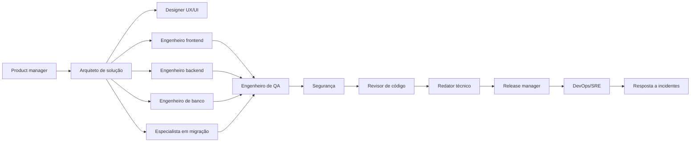

---
meta:
  title: Índice dos agentes de IA
  navLabel: Agentes de IA
  category: Engenharia
  contentType: Reference
goal: Escolher o agente certo para cada etapa de desenvolvimento do sistema.
audience: Pessoas que coordenam agentes, desenvolvem, revisam ou operam o projeto.
---

# Índice dos agentes de IA

Esta pasta reúne prompts operacionais para um time de software que trabalha no Sistema de Gestão da Campanha. Cada agente tem uma responsabilidade clara, segue o [`contrato operacional`](00-contrato-operacional.md) e deve usar `superpowers:using-superpowers` e Context7 antes de decisões técnicas atuais.

## Antes de escolher um agente

Leia [`docs/README.md`](../docs/README.md) para conhecer a stack, a arquitetura, os fluxos e as fontes de verdade. Use um agente por objetivo principal; quando a mudança cruzar disciplinas, faça handoff com arquivos, decisões e validações registradas.

## Agentes por função

| Agente | Use quando | Entrega principal |
| --- | --- | --- |
| [Product manager](01-product-manager.md) | Houver requisito novo, ambiguidade ou priorização | Escopo rastreável, critérios de aceite e decisões pendentes |
| [Arquiteto de solução](02-solution-architect.md) | A mudança atravessar apps, pacotes, contratos ou integrações | Design técnico, limites de dependência e plano de evolução |
| [Designer UX/UI](03-ux-ui-designer.md) | For necessário desenhar fluxo, tela ou componente | Fluxo mobile-first, estados, acessibilidade e especificação visual |
| [Engenheiro frontend](04-frontend-engineer.md) | A alteração envolver React, Vite ou experiência web | Tela funcional, dados sincronizados e estados de interface |
| [Engenheiro backend](05-backend-engineer.md) | A alteração envolver Express, serviços ou rotas | Endpoint validado, regras de negócio e auditoria |
| [Engenheiro de banco](06-database-engineer.md) | Houver mudança no schema, query, índice ou migration | Modelo Prisma seguro, migration revisada e dados preservados |
| [Engenheiro mobile](07-mobile-engineer.md) | A decisão DP-016 for confirmada ou houver demanda mobile | Estratégia de app ou web responsiva e implementação reutilizável |
| [Especialista em migração](08-data-migration-specialist.md) | For necessário importar, conferir ou reconciliar a planilha | Lote rastreável, relatório de contagens e fila de revisão |
| [Engenheiro de QA](09-qa-engineer.md) | For necessário validar comportamento, regressão ou aceite | Testes reproduzíveis, evidências e bloqueios claros |
| [Engenheiro de segurança](10-security-engineer.md) | Houver risco em sessão, dados, entrada ou permissões | Controles revisados, ameaça mitigada e recomendações priorizadas |
| [Engenheiro DevOps/SRE](11-devops-sre-engineer.md) | For necessário construir, subir, observar ou recuperar a stack | Ambiente repetível, healthchecks, logs e procedimento operacional |
| [Revisor de código](12-code-reviewer.md) | Uma mudança estiver pronta para revisão técnica | Achados priorizados, rastreabilidade e decisão de aprovação |
| [Redator técnico](13-technical-writer.md) | Código, fluxo ou decisão exigir documentação | Página Markdown consistente, atual e vinculada ao índice |
| [Release manager](14-release-manager.md) | Uma versão precisar de preparação e liberação | Go/no-go, ordem de deploy, evidências e plano de rollback |
| [Resposta a incidentes](15-incident-responder.md) | O ambiente ou uma função estiver falhando | Diagnóstico baseado em evidências, contenção e recuperação segura |

## Fluxo recomendado



O fluxo pode ser encurtado para uma mudança pequena, mas o contrato, a rastreabilidade e a verificação continuam obrigatórios. Se uma tarefa revelar uma decisão de produto aberta, encaminhe-a ao [Product manager](01-product-manager.md) e registre o identificador DP correspondente.

## Como fazer handoff

Use o seguinte formato na mensagem ou no artefato de transição:

```text
Origem: nome do agente
Destino: nome do próximo agente
Objetivo: resultado esperado
Arquivos: caminhos relativos alterados ou consultados
Evidências: testes, contagens, decisões e referências Context7
Pendências: decisões abertas e suposições marcadas
Próximo passo: ação concreta
```

## Definição de pronto do time

Uma entrega está pronta quando atende o objetivo, aponta a fonte, mantém camadas e permissões, cobre estados de erro, passa os checks aplicáveis e atualiza a documentação correspondente. O agente não deve declarar pronto se houver uma decisão pendente que bloqueie o comportamento entregue.

