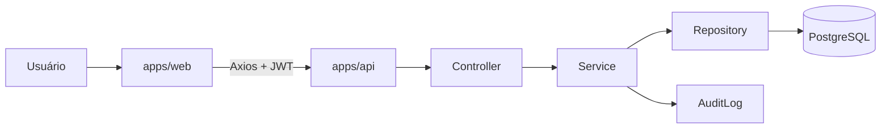

---
meta:
  title: Entender a arquitetura do monorepo
  navLabel: Arquitetura
  category: Engenharia
  contentType: Conceptual
goal: Explicar os limites entre aplicações, pacotes e camadas do backend.
audience: Desenvolvedores que implementam ou revisam mudanças.
---

# Entender a arquitetura do monorepo

O repositório usa npm workspaces e separa interface, API, persistência e contratos compartilhados. A separação permite trocar a implementação de uma camada sem duplicar regras de validação ou o modelo de dados.

## Mapa de pastas

```text
apps/
  web/       React + Vite, rotas e componentes da interface
  api/       Express, autenticação e módulos de negócio
  mobile/    reserva para a decisão DP-016
packages/
  database/  Prisma Client, schema, migration e seed
  types/     contratos TypeScript compartilhados
  validation schemas Zod para formulários e payloads
  ui/        tokens visuais compartilhados
docker/      entrypoint da API e configuração do Nginx
docs/        documentação operacional e técnica
```

## Fluxo de uma requisição



O frontend chama a API com Axios e reaproveita o JWT armazenado no estado de sessão. O controller traduz HTTP, o service aplica regras de negócio e o repository concentra consultas Prisma. Operações protegidas registram auditoria no mesmo fluxo de serviço.

## Regras de dependência

- Controllers recebem e respondem HTTP; não executam consultas Prisma
- Services decidem regras e registram auditoria; não renderizam interface
- Repositories encapsulam acesso ao Prisma; não conhecem React
- Schemas em `packages/validation` validam formulários e payloads da API
- Tipos em `packages/types` descrevem contratos sem acessar banco ou navegador
- Componentes visuais compartilhados ficam em `apps/web/src/components/ui`

## Contratos entre pacotes

Pacotes TypeScript publicam `dist/` para execução e `src/` para tipos durante o desenvolvimento. O build raiz compila `types`, `validation`, `database`, `api` e `web` nessa ordem. Não importe arquivos internos de outro pacote quando o pacote já expõe uma entrada pública.

## Decisões de implementação

O frontend atual é web responsivo e prioriza telas pequenas. O pacote mobile não escolhe PWA, React Native ou outra plataforma porque DP-016 está pendente. O backend usa PostgreSQL como fonte operacional, e a planilha entra por um fluxo explícito de importação e revisão.
