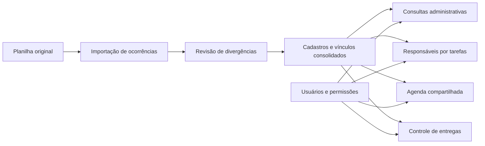

# Análise integrada do áudio e da planilha

Base para definição do sistema de gestão. Elaborado em 10/09/2026 a partir do áudio de aproximadamente 4min11s e da planilha `Campanha_EA_2026_REV-006.xlsx`.

## Entendimento central

O gestor descreve um **ambiente único com vários módulos administrativos**. A planilha é a base inicial do cadastro de pessoas, funções, localidades e vínculos. O áudio acrescenta controle de tarefas, níveis de acesso, agenda compartilhada e possível notificação interna por WhatsApp. A logística de materiais aparece como outro uso desejado.

A estrutura do arquivo confirma parte dessa visão: há 54 abas territoriais e 17 abas de dobradas, ligadas a 9 índices. Entretanto, as abas repetem registros, os totais são manuais e existem inconsistências. **A primeira necessidade do sistema é consolidar os cadastros e seus relacionamentos em uma base única, com revisão da origem dos dados.** Reproduzir 80 abas como 80 bases independentes manteria os mesmos problemas.

O trabalho realizado é de análise e especificação preliminar. As falas do áudio foram tratadas como material de referência, não como autorização para enviar mensagens, publicar informações ou executar integrações. Nenhuma alteração foi feita na planilha original.

## Documentos que compõem a análise

- [Transcrição integral do áudio](Transcricao_do_audio.md), com tempos aproximados e marcação das passagens incertas.
- [Análise detalhada da planilha](Analise_da_planilha.md), com contagens, dicionário de campos, divergências e inventário de todas as abas.
- Este documento, que cruza o conteúdo do áudio com a estrutura real do arquivo e propõe o escopo administrativo a validar.

## O que o áudio efetivamente pede

Os tempos são aproximados. “Explícito” significa mencionado no áudio. Isso não significa que todas as regras operacionais já estejam definidas.

A transcrição foi produzida localmente e revisada por comparação de reconhecimentos automáticos, sem validação auditiva humana. O nome em 03:14–03:16 e a expressão sobre a API do WhatsApp em 03:48–03:50 permanecem marcados como incertos. Nenhuma conclusão depende da confirmação desse nome próprio.

| Trecho | Conteúdo da fala | Evidência na planilha | Consequência para a definição do sistema |
|---|---|---|---|
| 00:11–00:25 | Um hub com módulos de ferramentas | O arquivo cobre apenas uma parte desse ambiente | Organizar navegação e permissões por módulos |
| 00:27–00:58 | Articulador com visão regional, coordenador por cidade e seus liderados | Colunas Articulador, Coordenador e Liderança | Representar pessoas e suas responsabilidades sem duplicar o cadastro |
| 00:59–01:26 | Guardar a informação de dobrada, explicada como o federal junto com Edson | Coluna Dep Federal e 17 abas por nome | Registrar vínculos explicitamente e conferir nomenclatura |
| 01:27–01:42 | Enxergar o estado e a existência ou ausência de cadastros de coordenação/liderança por cidade | Índice geral, índices regionais e abas territoriais | Exibir completude cadastral, distinguindo ausência de informação de ausência confirmada |
| 01:44–02:02 | Filtrar região/cidade e comunicar um evento para mobilização | Localidade na aba e campo Região; contatos incompletos | A intenção está documentada como fala. Não é uma rotina de comunicação implementada ou autorizada nesta análise |
| 02:03–02:22 | Apoiar a organização de entregas de material gráfico | Apenas referências territoriais e contatos parciais | Um controle administrativo de entregas precisa de dados novos |
| 02:29–02:58 | Pessoas selecionadas e habilitadas para inserir novas lideranças; necessidade de agilidade | Não existem usuários, permissões ou histórico na planilha | Cadastro por usuários autenticados, com permissões e registro de alterações |
| 03:05–03:23 | Gestão de tarefas e Kanban de pendências, com usuários de mesmo nível de acesso | Não há cadastro de tarefas | Módulo próprio de tarefas e permissões |
| 03:24–03:37 | Agenda online acessível por link simples e atualizada para as pessoas necessárias | Não há eventos nem agenda | Agenda compartilhada, com definição de quem pode visualizar e editar |
| 03:38–03:58 | Possível alerta no WhatsApp dos coordenadores gerais quando uma agenda for cadastrada | Não há números de destinatários desse serviço nem integração | Requisito futuro condicionado à definição do canal, destinatários e regras de envio |

O termo “mapa” pode significar uma visão organizada do estado ou um mapa geográfico interativo. O áudio não resolve essa diferença. Também não define navegação rodoviária, cálculo automático de trajetos, disparos em massa ou importação contínua do Drive.

## Como interpretar a hierarquia descrita

A fala apresenta a relação conceitual **articulador regional → coordenador municipal → liderados**. A planilha aproxima esse desenho em colunas, mas não impõe suas regras: 366 de 681 linhas territoriais não têm coordenador preenchido e duas não têm articulador.

Não é possível concluir que cada pessoa tenha exatamente um superior, atue em apenas uma cidade ou possa ter apenas uma dobrada. A frase “geralmente [...] um coordenador” descreve uma prática, não uma restrição absoluta.

O sistema deve permitir registrar os relacionamentos observados e sinalizar pendências. A quantidade de responsáveis por território, a possibilidade de acumular funções e a vigência dos vínculos precisam ser definidas com o gestor antes de estabelecer bloqueios no banco de dados.

## O que o arquivo permite afirmar hoje

| Medida | Resultado verificado | Interpretação correta |
|---|---:|---|
| Abas | 80 | Estrutura física do arquivo |
| Linhas territoriais preenchidas | 681 | Ocorrências de cadastro, antes da conciliação |
| Linhas territoriais com Liderança preenchida | 676 | Presença de conteúdo no campo |
| Total territorial exibido | 672 | Valor manual desatualizado em relação às linhas |
| Linhas em abas de dobradas | 739 | Ocorrências em visões que repetem cadastros |
| Total de dobradas exibido | 591 | Valor manual que diverge das abas |
| Linhas territoriais com contato de liderança | 160 de 681 | 23,5% com conteúdo, ainda sem comprovação de validade |
| Pessoas únicas | Não determinado | Requer conciliação e confirmação dos casos ambíguos |

Uma anomalia explica a diferença das dobradas: o bloco `A22:H58`, de 37 linhas, das abas Marta Rocha, Sostenes, Abraão e Luciano Vieira é idêntico ao mesmo intervalo da aba Vinicius Farah. As quatro repetições somam 148 linhas. Isso indica possível resíduo de cópia; não comprova que os vínculos sejam válidos ou inválidos. Os blocos precisam de revisão antes de integrar a base definitiva.

O vazio de um campo ou a ausência de uma aba não demonstra ausência real de pessoas na localidade. Demonstra apenas falta de informação no arquivo. Da mesma forma, linhas não equivalem a eleitores, votos ou pessoas únicas.

## Proposta de organização do sistema

As propostas abaixo são recomendações de estrutura administrativa derivadas da análise. Não são funcionalidades já aprovadas em detalhe pelo gestor.

### 1. Cadastros e responsabilidades

Cadastro único de pessoa, com nome de exibição, variantes conhecidas, contatos e estado de revisão. Os papéis de articulador, coordenador e liderança são relações vinculadas a essa pessoa e ao contexto em que ela atua. Localidade e vínculo deixam de depender do nome de uma aba.

As telas administrativas permitem localizar um cadastro, consultar sua origem, corrigir informações autorizadas e identificar pendências. Não devem deduzir identidade, religião ou vínculos ausentes a partir de nomes, títulos ou proximidade entre registros.

### 2. Usuários e permissões

O usuário que acessa o sistema é uma entidade distinta da pessoa cadastrada. Estar na planilha não dá acesso automático ao sistema. A proposta inicial é separar administração, edição e consulta, com escopo definido por módulo e responsabilidade, sujeito à validação do gestor.

As permissões devem ser verificadas também no servidor. Deve existir registro de quem criou, alterou ou desativou um cadastro. Exclusões precisam preservar a rastreabilidade e o tratamento de relações dependentes.

### 3. Tarefas e Kanban

O pedido explícito é acompanhar tarefas pendentes em Kanban. A planilha não fornece tarefas iniciais. Uma proposta mínima de campos é título, descrição, responsável, prazo, status e histórico. “A fazer”, “Em andamento” e “Concluído” são estados sugeridos, a confirmar.

É necessário definir se cada pessoa vê apenas suas tarefas, as de sua equipe ou todas as tarefas de um módulo. O áudio menciona usuários com o mesmo nível de acesso, mas não descreve a matriz completa de permissões.

### 4. Agenda compartilhada

O pedido explícito é consultar uma agenda por link simples e manter as informações atualizadas para as pessoas necessárias. Os campos mínimos sugeridos são título, início, término, local, responsável, descrição, status e visibilidade.

Os horários precisam ter fuso definido. Duas edições simultâneas do mesmo compromisso não devem sobrescrever silenciosamente as alterações uma da outra.

“Link simples” não determina que a agenda deva ser pública. É preciso escolher entre acesso autenticado e link de consulta controlado e revogável. Abrir uma agenda também não implica permissão de edição. Cancelamentos e alterações devem aparecer de forma consistente para quem tem acesso.

### 5. Controle administrativo de materiais e entregas

A fala menciona entregas de material gráfico. Para um módulo de controle, faltam cadastro de material, quantidade, unidade, origem, destino, endereço, responsável, data e situação da entrega. O arquivo atual não contém dados suficientes para gerir estoque ou registrar o recebimento.

Uma primeira versão pode registrar solicitações, saídas e entregas com histórico. Qualquer serviço de mapas ou cálculo de trajetos depende de requisitos adicionais e não está especificado pelo material recebido.

### 6. Alertas internos de agenda

O áudio apresenta alertas por WhatsApp como possibilidade. A proposta técnica a validar é restringir o evento inicial de notificação ao cadastro de compromisso e usar destinatários internos explicitamente configurados. Edições, cancelamentos e lembretes são decisões adicionais, não pedidos já fechados.

O sistema deve registrar tentativas e resultados, evitar envio duplicado e permitir nova tentativa em caso de falha. A agenda precisa funcionar independentemente da disponibilidade do serviço de mensagens. Nenhuma integração ou mensagem foi executada nesta etapa.

## Modelo conceitual sugerido

| Entidade | Responsabilidade | Origem |
|---|---|---|
| Pessoa | Identidade interna e nome de exibição | Nomes existentes na planilha |
| Contato | Telefone e outros meios associados à pessoa certa | Campos Contato, com titularidade a confirmar |
| Localidade | Município, distrito ou área local, com tipo e hierarquia explícitos | Índices, nomes de abas e campo Região |
| Papel / responsabilidade | Função da pessoa e seu contexto, com vigência quando necessária | Articulador, Coordenador e Liderança |
| Vínculo | Relação declarada entre cadastro e dobrada, sem duplicar pessoa | Dep Federal e abas de dobradas |
| Usuário / permissão | Conta, ações permitidas e escopos de acesso | Pedido de pessoas habilitadas no áudio |
| Tarefa | Pendência, responsável, prazo, status e histórico | Pedido de Kanban |
| Evento de agenda | Compromisso, horário, local, responsáveis e visibilidade | Pedido de agenda online |
| Material / movimentação / entrega | Itens e registros de saída e recebimento | Necessidade administrativa derivada da fala de logística |
| Importação / ocorrência de origem | Arquivo, aba, linha, valor original e decisão de conciliação | Necessidade técnica para a migração |
| Histórico de alteração | Autor, data e mudança realizada | Recomendação técnica de rastreabilidade |
| Notificação | Evento, destinatário configurado, tentativa e resultado | Possível integração citada no áudio |

O identificador de uma ocorrência importada não deve ser confundido com o identificador de uma pessoa. A mesma pessoa pode ter várias ocorrências de origem. Do mesmo modo, o identificador de um usuário não precisa ser o identificador de uma liderança.

O desenho mostra a proposta de organização, não uma implementação já existente.

## Plano de migração recomendado

1. **Guardar a origem.** Preservar a revisão recebida e identificar o lote por arquivo e hash. Não editar a evidência para fazê-la coincidir com o resultado esperado.
2. **Classificar as 80 abas.** Separar índices, cadastros territoriais e recortes de dobradas. Índices são controles de conferência, não registros de pessoas.
3. **Importar para uma área de revisão.** Registrar valores originais, aba e linha. Desconsiderar linhas apenas formatadas e espaços isolados sem perder registros parcialmente preenchidos.
4. **Mapear os cabeçalhos.** Aplicar a exceção de Paty do Alferes e diferenciar os dois campos Contato pela semântica, não só pelo rótulo repetido.
5. **Normalizar sem apagar o original.** Preparar chaves de comparação para nomes, localidades e telefones. Manter apelidos, variantes e ambiguidades para conferência. Não corrigir nomes próprios automaticamente.
6. **Conciliar ocorrências e vínculos.** Comparações exatas sugerem correspondência; nomes iguais, sozinhos, não autorizam fusão. Revisar blocos repetidos, conteúdos deslocados e divergências entre abas antes de escolher o valor definitivo.
7. **Publicar cadastros revisados e pendências identificadas.** Casos ainda incompletos podem existir com sinalização apropriada. Não inventar coordenador, telefone, liderança ou dobrada para satisfazer campo obrigatório.
8. **Reconciliar por lote.** Demonstrar quantas linhas foram lidas, ignoradas por estarem vazias, conciliadas, mantidas em revisão e incorporadas. Contar pessoas e vínculos separadamente.
9. **Evitar repetição da mesma carga.** Reimportar o mesmo arquivo não deve gerar novas pessoas ou novos vínculos duplicados. Revisões futuras exigem correspondência com identificadores do sistema e histórico, pois linhas podem mudar de posição.

Não recomendo tratar todas as abas territoriais como verdade absoluta nem todas as dobradas como fonte descartável. O conteúdo é parcialmente redundante e apresenta informações divergentes; a preferência entre fontes precisa ser definida por campo e caso.

## Etapas de entrega sugeridas

| Etapa | Entrega administrativa | Por que entra nessa ordem |
|---|---|---|
| 1 | Validação das regras, importação com revisão, cadastro único, autenticação e permissões | Os demais módulos dependem de pessoas e dados confiáveis |
| 2 | Consultas de cadastro, indicadores de completude, Kanban e agenda compartilhada | Atende os pedidos operacionais explícitos sem depender de integração externa |
| 3 | Controle de materiais/entregas e alertas internos de agenda | Depende de dados novos e de regras de operação ainda não definidas |

Essa ordem é uma sugestão. O áudio indica urgência, mas não informa prazo de entrega, orçamento, quantidade de usuários ou prioridade entre Kanban e agenda. Não há base para fixar cronograma ou estimativa de custo confiável nesta etapa.

## Critérios de aceite propostos

- A revisão de importação reconhece 80 abas e reproduz as contagens brutas de 681 linhas territoriais e 739 linhas nas dobradas. O total final de pessoas não fica fixado nesses números.
- O relatório de conciliação evidencia as diferenças de +9 e +148 e mostra os intervalos de origem dos registros em revisão.
- `Paty do Alferes!E:F` é lida de acordo com seus cabeçalhos; um telefone não entra no campo de região por erro de posição.
- Os quatro blocos de 37 linhas e o possível deslocamento de Paraty são apresentados para revisão, sem correção silenciosa.
- Reimportar o mesmo lote não cria novos cadastros duplicados. Uma consolidação preserva a ligação com todas as ocorrências de origem.
- A falta de telefone, coordenador ou liderança aparece como pendência específica, sem apagar a linha original nem inventar valores.
- Pessoas com nomes iguais podem permanecer separadas. Fusões de cadastros registram o responsável e preservam rastreabilidade.
- Um usuário sem permissão não consegue editar por tela ou por chamada direta ao servidor. Pessoas cadastradas não recebem acesso automaticamente.
- Uma mudança de status no Kanban e uma edição da agenda ficam disponíveis para os usuários autorizados, com autor e data registrados.
- O modo de compartilhamento da agenda corresponde à decisão do gestor e permite revogação de acesso quando aplicável.
- Quando a notificação interna for habilitada, o mesmo evento não gera envios duplicados; falha no canal não impede salvar o compromisso.

## Decisões que ainda precisam do gestor

1. **Papéis e relações:** pode haver mais de um coordenador por cidade? Uma pessoa pode acumular funções, localidades e dobradas? Qual a regra de histórico quando esses vínculos mudam?
2. **Significado dos contatos:** o primeiro Contato pertence ao coordenador e o segundo à liderança? Há telefones compartilhados ou de representantes?
3. **Fonte de referência:** quem valida os quatro blocos de 37 linhas, o deslocamento de Paraty, os nomes divergentes e os vínculos conflitantes entre abas?
4. **Territórios:** “mapa” significa mapa geográfico ou visão por listas? Quais níveis precisam existir: município, distrito, bairro e região administrativa?
5. **Acesso:** quem administra, quem cadastra e quem apenas consulta? Quais informações cada perfil pode ver e exportar?
6. **Agenda:** quem pode criar, editar e cancelar? O link serve apenas para consulta? Edson terá acesso autenticado ou um link controlado?
7. **Kanban:** quais estados, responsáveis, prazos e regras de visibilidade são necessários na primeira versão?
8. **Logística:** o objetivo inicial é acompanhar entregas, controlar estoque ou ambos? Quem informa endereços, quantidades e recebimentos?
9. **WhatsApp:** quais destinatários internos e quais eventos devem gerar aviso? Já existe canal institucional disponível para essa integração?
10. **Dados e operação:** quais campos realmente precisam ser mantidos, especialmente religião? Qual será a política de acesso, conservação, backup e exportação?
11. **Entrega:** qual prazo, número de usuários simultâneos e prioridade da primeira versão? A base passará a ser mantida exclusivamente no sistema ou continuará recebendo revisões do Drive?

Essas decisões refinam a implementação. Elas não impedem concluir a transcrição, a leitura completa da planilha e o levantamento apresentado aqui.
